<div align=center class="logo">
      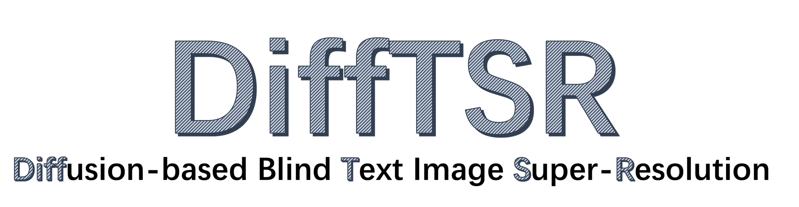
   </a>
</div>

#
Diffusion-based Blind Text Image Super-Resolution (CVPR2024)
<a href='https://openaccess.thecvf.com/content/CVPR2024/papers/Zhang_Diffusion-based_Blind_Text_Image_Super-Resolution_CVPR_2024_paper.pdf'></a> &nbsp;&nbsp;
<a href='https://openaccess.thecvf.com/content/CVPR2024/supplemental/Zhang_Diffusion-based_Blind_Text_CVPR_2024_supplemental.pdf'></a> &nbsp;&nbsp;

[Yuzhe Zhang](https://yuzhezhang-1999.github.io/)<sup>1</sup> | [Jiawei Zhang](https://scholar.google.com/citations?user=0GTpIAIAAAAJ)<sup>2</sup> | Hao Li<sup>2</sup> | [Zhouxia Wang](https://scholar.google.com/citations?user=JWds_bQAAAAJ)<sup>3</sup> | Luwei Hou<sup>2</sup> | [Dongqing Zou](https://scholar.google.com/citations?user=K1-PFhYAAAAJ)<sup>2</sup> | [Liheng Bian](https://scholar.google.com/citations?user=66IFMDEAAAAJ)<sup>1</sup>

<sup>1</sup>Beijing Institute of Technology, <sup>2</sup>SenseTime Research, <sup>3</sup>The University of Hong Kong

## 💬 Q&A
Please Read Before Trying.

<details>
<summary> 🇨🇳 中文 Q&A：对于大家关心的一些细节问题，这里进行了归纳供大家参考 (点击展开) </summary>

0. **DiffTSR的对真实世界图片的泛化性，是否泛化到Real-World Scenarios？**

   **A:** DiffTSR在训练过程中考虑到了真实世界的各种退化，继承了BSRGAN和Real-ESRGAN中对于复杂退化流程的构建。且“Blind Text Image Super-Resolution”的Blind-盲图像恢复就是指针对真实世界未知退化的图像恢复。


1. **IDM 中 Unet 用的是 Stable-Diffusion 的权重吗？**

   **A:** 不是。IDM 的 Unet 是从头训练的，没有加载任何预训练权重，IDM 的结构也和任何一个 Diffusion 模型的 Unet 不一致。但是 VAE 是加载了 ldm 的 f4 VAE 在 Open-Image 上预训练的权重，然后在本项目的 CTR-TSR-Train 数据集上进行了微调，微调了 100,000 iter，batch_size=16。此外，包括 TDM 和 MoM 在内的模型均未使用预训练模型，均为从头训练获得。详细训练设置请看 [附加材料](https://openaccess.thecvf.com/content/CVPR2024/supplemental/Zhang_Diffusion-based_Blind_Text_CVPR_2024_supplemental.pdf) Section 1.4。

2. **DiffTSR 模型的输入尺寸和要求，需要将输入 resize 吗？**

   **A:** 模型的 LR 输入需要统一 resize 到 `width=512` / `height=128`。此外，因为本项目仅考虑单行文本输入，输入图片需要只包含一行文本。IDM 和 TDM 仅适配单行文本，多行文本输入会导致效果扭曲和错误的结果。

3. **图片的推理速度非常慢，有什么解决办法吗？**

   **A:** 由于本项目基于 Diffusion 技术，每处理一张图像都需要进行 `T` 次迭代（默认 `T=200`）。若想提升推理速度，可以考虑：
   
   - **减小 `T`**，由于采样器为 DDIM，在 `T=20` 时仍有较好表现。
   - **对 DiffTSR 模型进行量化**，可参考 Diffusion 模型量化的相关 Repo。
   - **使用本项目的 Baseline model**，虽然 Baseline 会在一定程度上降低性能，但可提升约 2 倍的推理速度，并且在大多数场景下不会明显退化。
   - **对模型进行蒸馏**，或基于论文训练一个更小的 IDM 模型，文本场景可能不需要像通用场景图像生成那样重的模型。

4. **在训练 IDM 时，损失是如何设置的？text_recognition loss 是如何实现的？**

   **A:** 训练 IDM 时使用了两个损失函数：
   
   - **L2 loss**：用于预测噪声。
   - **OCR loss**：用于从预测出的干净 `x^0` 上检测文字。
   
   具体来说：
   - L2 loss 是传统 diffusion 模型中用于最小化 `(Unet 输出 - noise map)`，使 Unet 具备噪声估计能力。
   - OCR loss 通过 `z_t` 计算 `z^(t-1)`，再得到 `z^0`，然后解码 `z^0` 得到 `x^0`。将 `x^0` 输入冻结权重的 TransOCR 模型，获得 `x^0` 上的文字 embedding，计算预测的 `pred-text-embedding` 和 `gt-text-embedding` 之间的 cross-entropy loss，OCR loss 额外添加了 `weight=0.02` 约束。
   
   详细内容参见 [Issue](https://github.com/YuzheZhang-1999/DiffTSR/issues/13)。

5. **训练的损失函数是什么？**

   **A:** DiffTSR 模型训练经历了三个阶段，每个阶段使用了不同损失函数的组合：
   
   - **训练 IDM**：IDM 从头训练 Unet，损失函数为 `L_IDM`，包含 `L2 loss` 和 `OCR loss`。
   - **训练 TDM**：TDM 从头训练 Transformer，损失函数为 `L_TDM`，参考 [Multinomial Diffusion](https://arxiv.org/pdf/2102.05379) Section 4。
   - **训练 DiffTSR 整体**：冻结 IDM 和 TDM，仅训练 MoM，损失函数为 `L_MoM = L_IDM + L_TDM * weight`。
   
   其中：
   
   $$
   L_{IDM} = L_2 + \lambda*L_{OCR}, \lambda=0.02
   $$

   $$
   L_{TDM} = KL(\mathcal{C(\pi_{post}(\mathbf{c_t}, \mathbf{c_0}))} || \mathcal{C(\pi_{post}(\mathbf{c_t}, \mathbf{c_{pred, t}}))})
   $$

   $$
   L_{MoM} = L_{IDM} + \lambda*L_{TDM}, \lambda=1
   $$

   具体符号定义和理论推导详见 [附加材料](https://openaccess.thecvf.com/content/CVPR2024/supplemental/Zhang_Diffusion-based_Blind_Text_CVPR_2024_supplemental.pdf) Section 1 及 Algorithm 1 DiffTSR Training。

   **未完待续...**

</details>

<details>
<summary>🇬🇧 English Q&A: For some details you may want to know, here is a summary for your reference (click to expand)</summary>

0. **Generalization of DiffTSR to Real-World Scenarios**

   **A:** DiffTSR takes various real-world degradations into account during training, inheriting the complex degradation modeling from BSRGAN and Real-ESRGAN. Moreover, the "Blind" in "Blind Text Image Super-Resolution" specifically refers to the restoration of images with unknown degradations, which is targeted at real-world scenarios.

1. **Does the Unet in IDM use Stable-Diffusion weights?**

   **A:** No. The Unet in IDM is trained from scratch and does not load any pre-trained weights. Additionally, the structure of IDM is different from any Diffusion model's Unet. However, the VAE loads the pre-trained weights from `ldm f4 VAE`, which was pre-trained on the Open-Image dataset and then fine-tuned on the CTR-TSR-Train dataset in this project. The fine-tuning was conducted for 100,000 iterations with a batch size of 16. Moreover, models including TDM and MoM were also trained from scratch without using any pre-trained models. For detailed training settings, please refer to [Supplementary Material](https://openaccess.thecvf.com/content/CVPR2024/supplemental/Zhang_Diffusion-based_Blind_Text_CVPR_2024_supplemental.pdf) Section 1.4.

2. **What are the input size and requirements for the DiffTSR model? Does the input need to be resized?**

   **A:** The LR input of the model needs to be uniformly resized to `width=512` and `height=128`. Additionally, since this project only considers single-line text input, the input image must contain only one line of text. Both IDM and TDM are designed specifically for single-line text, and multi-line text input will result in distortion and incorrect results.

3. **The inference speed of the image is very slow. What are the possible solutions?**

   **A:** Since this project is based on Diffusion technology, processing a single image requires `T` iterations (default `T=200`). To improve inference speed, you may consider:
   
   - **Reducing `T`**, as the sampler is DDIM, and it still performs well at `T=20`.
   - **Quantizing the DiffTSR model**, referring to relevant repositories on Diffusion model quantization.
   - **Using the project's Baseline model**, which, although it may slightly reduce performance, provides approximately 2× speed-up while maintaining acceptable performance in most scenarios.
   - **Performing model distillation on IDM** or training a smaller IDM model. In textual scenarios, a heavy model like general image generation may not be necessary.

4. **How is the loss function set when training IDM? How is the text recognition loss implemented?**

   **A:** When training IDM, two loss functions are used:
   
   - **L2 loss**: Used for predicting noise.
   - **OCR loss**: Used for detecting text from the predicted clean `x^0`.
   
   Specifically:
   - **L2 loss** is the traditional loss used in diffusion models, minimizing the difference between Unet output and noise map, enabling Unet to estimate noise.
   - **OCR loss** is computed by first obtaining `z^(t-1)` from `z_t`, then deriving `z^0`, and subsequently decoding `z^0` to obtain `x^0`. The decoded `x^0` is fed into a frozen TransOCR model to obtain the text embedding in `x^0`. The cross-entropy loss is then computed between the predicted text embedding (`pred-text-embedding`) and the ground truth text embedding (`gt-text-embedding`). A weight constraint of `weight=0.02` is applied to the OCR loss.
   
   For more details, see [Issue](https://github.com/YuzheZhang-1999/DiffTSR/issues/13).

5. **What are the loss functions used during training?**

   **A:** The DiffTSR model training consists of three stages, each using a different combination of loss functions:
   
   - **Training IDM**: IDM trains Unet from scratch using loss `L_IDM`, which includes L2 loss and OCR loss.
   - **Training TDM**: TDM trains the Transformer from scratch using loss `L_TDM`, referring to [Multinomial Diffusion](https://arxiv.org/pdf/2102.05379) Section 4.
   - **Training the entire DiffTSR**: IDM and TDM are frozen, and only MoM is trained with loss `L_MoM = L_IDM + L_TDM * weight`.
   
   Where:
   
   $$
   L_{IDM} = L_2 + \lambda*L_{OCR}, \lambda=0.02
   $$

   $$
   L_{TDM} = KL(\mathcal{C(\pi_{post}(\mathbf{c_t}, \mathbf{c_0}))} || \mathcal{C(\pi_{post}(\mathbf{c_t}, \mathbf{c_{pred, t}}))})
   $$

   $$
   L_{MoM} = L_{IDM} + \lambda*L_{TDM}, \lambda=1
   $$

   For detailed symbol definitions and theoretical derivations, see [Supplementary Material](https://openaccess.thecvf.com/content/CVPR2024/supplemental/Zhang_Diffusion-based_Blind_Text_CVPR_2024_supplemental.pdf) Section 1 and Algorithm 1 DiffTSR Training.

   **To be continued...**


</details>


## 📢 News
- 🚀Training Code has been released, enjoy.
- **2024.05** 🚀Inference code has been released, enjoy.
- **2024.04** 🚀Official repository of DiffTSR.
- **2024.03** 🌟The implementation code will be released shortly.
- **2024.03** ❤️Accepted by CVPR2024.

## 🔥 TODO
- [x] Attach the detailed implementation and supplementary material.
- [x] Add inference code and checkpoints for blind text image SR.
- [x] Add training code and scripts.

## 👁️ Gallery

[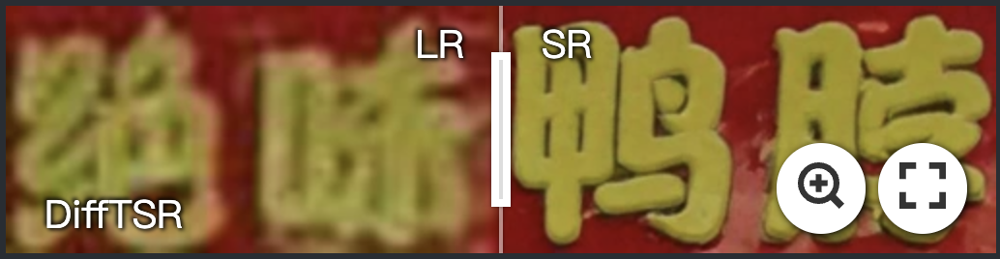](https://imgsli.com/MjY0MTk5) [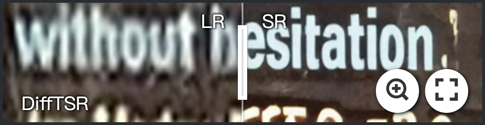](https://imgsli.com/MjY0MjA0)

## 🛠️ Try
### Dependencies and Installation

- Pytorch >= 1.7.0
- CUDA >= 11.0
```
# git clone this repository
git clone https://github.com/YuzheZhang-1999/DiffTSR
cd DiffTSR

# create new anaconda env
conda env create -f environment.yaml
conda activate DiffTSR
```
### Download the checkpoint
Please download the checkpoint file from the URL below to the ./ckpt/ folder.

- [[GoogleDrive](https://drive.google.com/drive/folders/1K6k5ZcvF3w-1MDN_gXQTdsLgFZ2SM8qy?usp=drive_link)] 

- [[BaiduDisk](https://pan.baidu.com/s/1hfaQzIp_V6H8AhAq5dfr8A)] [Password: vk9n] 


### Inference
```
python inference_DiffTSR.py
# check the code for more detail
```

### Training
```
# cd DiffTSR/train/README_train.md
# check the README_train for training details
# Please note that you need to carefully review the training sh file and the configuration yaml. Some of the configurations need to be modified according to your data or address. 
```


## 🔎 Overview of DiffTSR
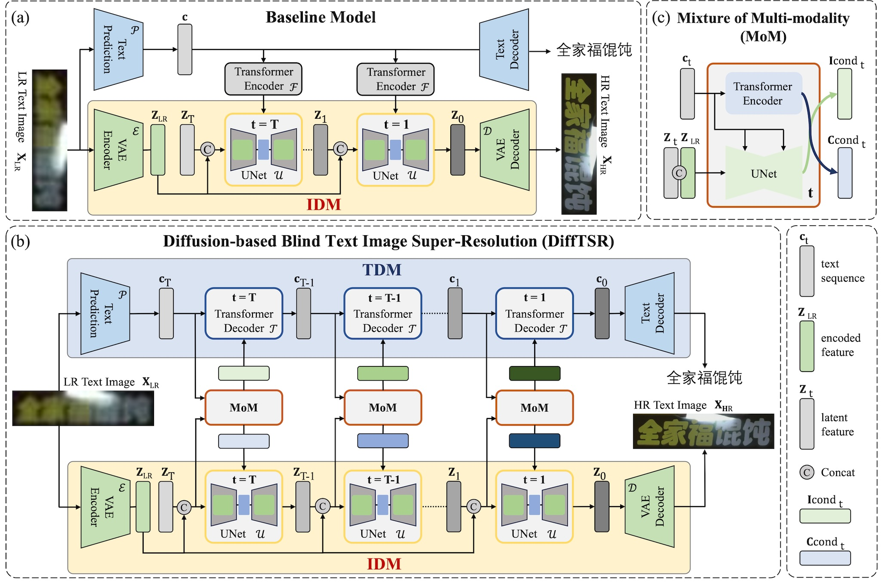
### Abstract
Recovering degraded low-resolution text images is challenging, especially for Chinese text images with complex strokes and severe degradation in real-world scenarios.
Ensuring both text fidelity and style realness is crucial for high-quality text image super-resolution.
Recently, diffusion models have achieved great success in natural image synthesis and restoration due to their powerful data distribution modeling abilities and data generation capabilities
In this work, we propose an Image Diffusion Model (IDM) to restore text images with realistic styles.
For diffusion models, they are not only suitable for modeling realistic image distribution but also appropriate for learning text distribution.
Since text prior is important to guarantee the correctness of the restored text structure according to existing arts, we also propose a Text Diffusion Model (TDM) for text recognition which can guide IDM to generate text images with correct structures.
We further propose a Mixture of  Multi-modality module (MoM) to make these two diffusion models cooperate with each other in all the diffusion steps.
Extensive experiments on synthetic and real-world datasets demonstrate that our Diffusion-based Blind Text Image Super-Resolution (DiffTSR) can restore text images with more accurate text structures as well as more realistic appearances simultaneously.

### Visual performance comparison overview 
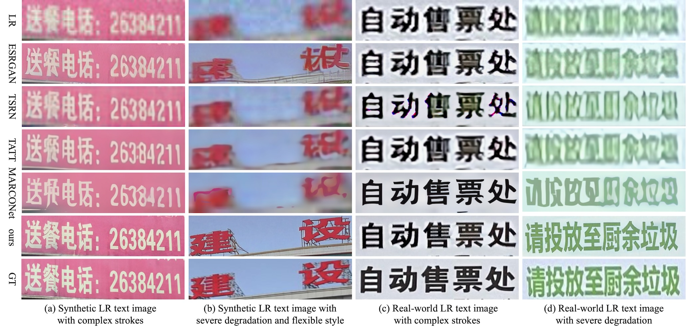
Blind text image super-resolution results between different methods on synthetic and real-world text images. Our method can restore text images with high text fidelity and style realness under complex strokes, severe degradation, and various text styles.


<details>
  <summary>📷 More Visual Results</summary>

  ## 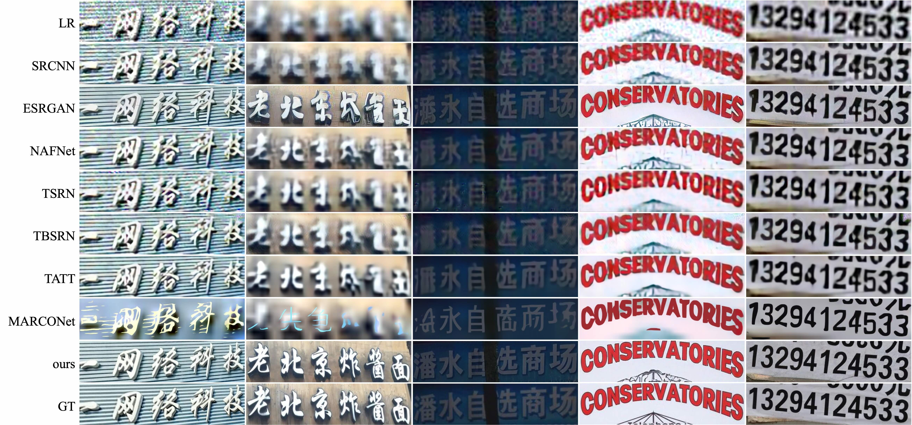
  ## 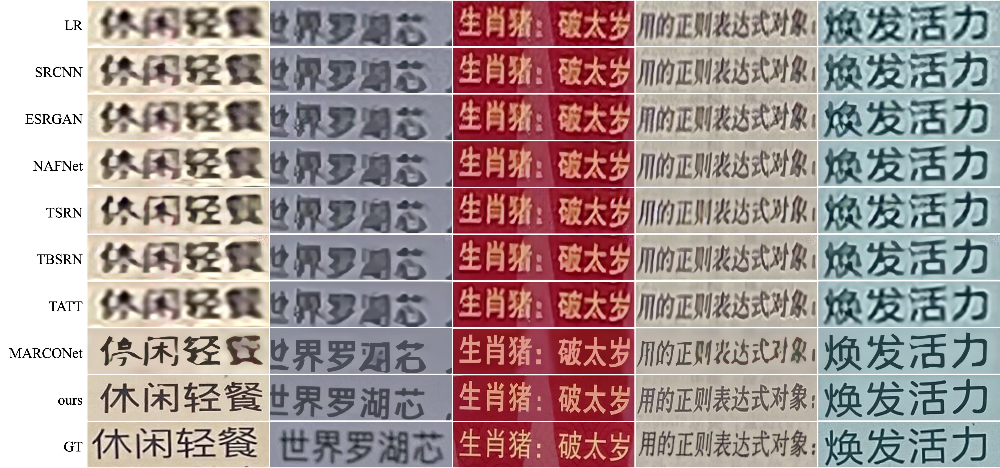
  ## 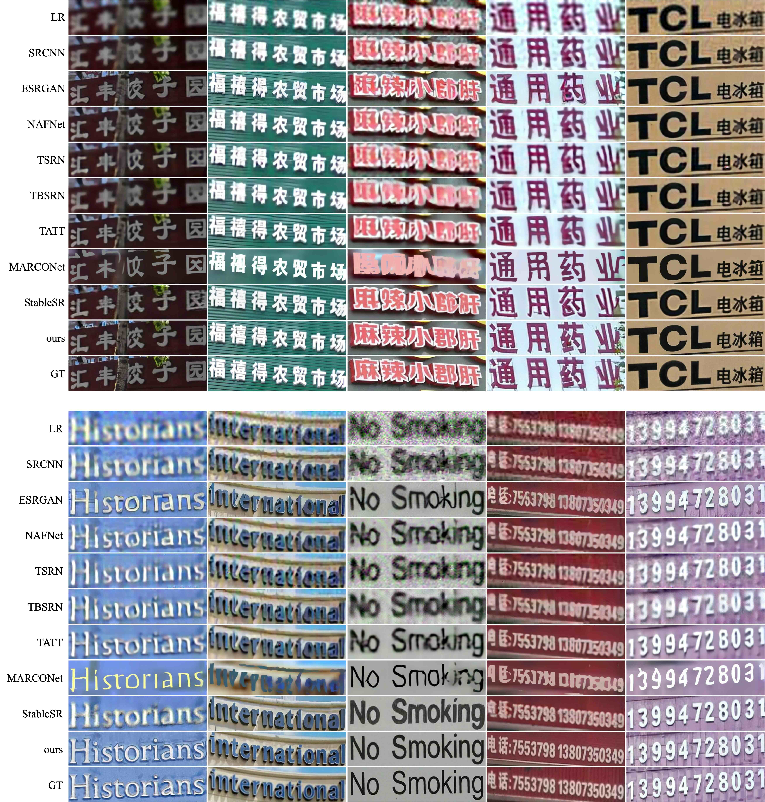
  ## 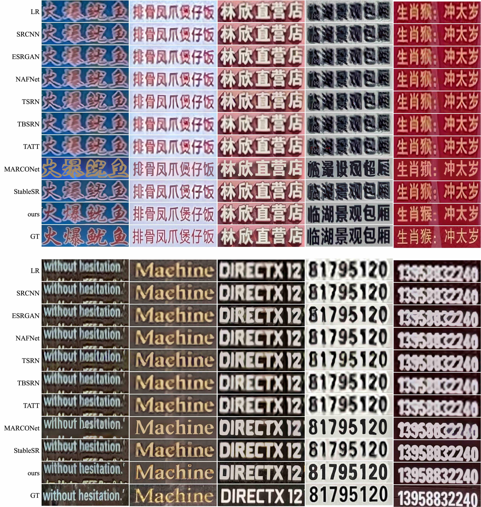
  ## 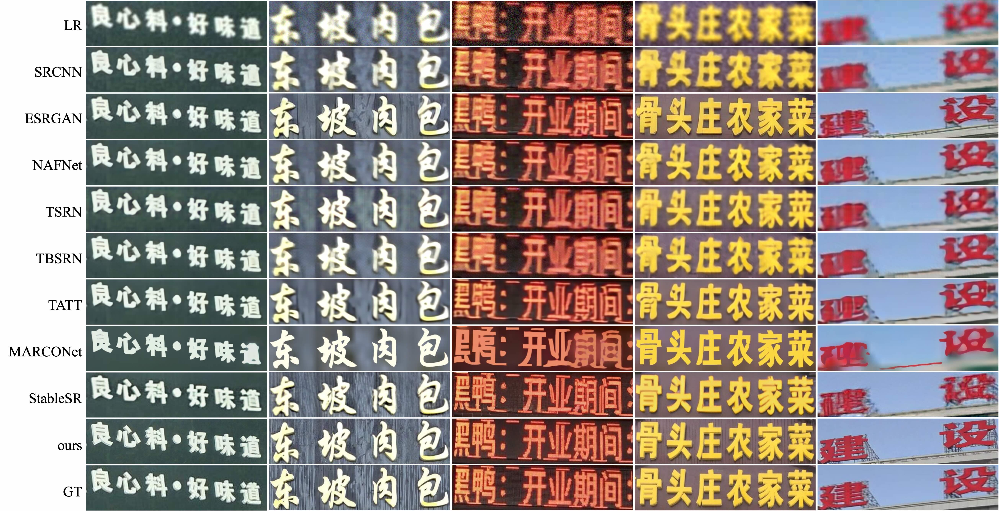
  ## 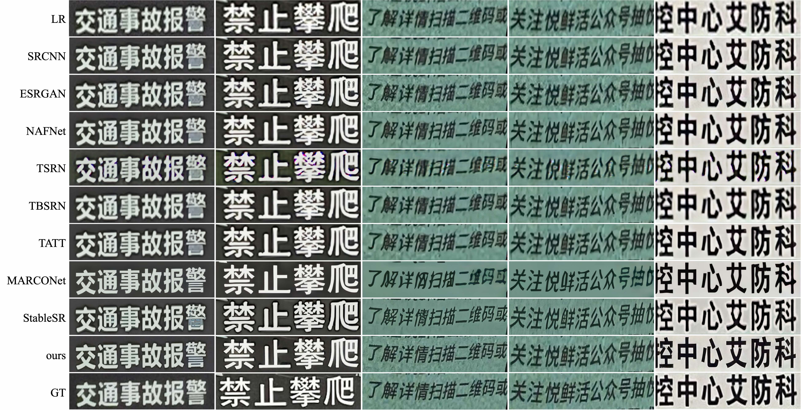

</details>


## 🎓Citations
```
@inproceedings{zhang2024diffusion,
  title={Diffusion-based Blind Text Image Super-Resolution},
  author={Zhang, Yuzhe and Zhang, Jiawei and Li, Hao and Wang, Zhouxia and Hou, Luwei and Zou, Dongqing and Bian, Liheng},
  booktitle={Proceedings of the IEEE/CVF Conference on Computer Vision and Pattern Recognition},
  pages={25827--25836},
  year={2024}
}
```

## 🎫 License
This project is released under the [Apache 2.0 license](LICENSE).

## Acknowledgement
Thanks to these awesome work：
- [Latent Diffusion](https://github.com/CompVis/latent-diffusion)
- [Benchmarking Chinese Text Recognition](https://github.com/FudanVI/benchmarking-chinese-text-recognition)

<details>
<summary>Statistics</summary>


</details>